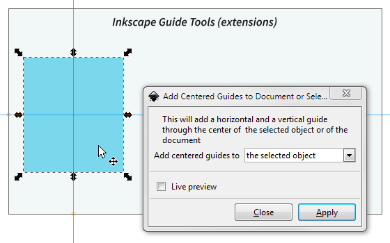
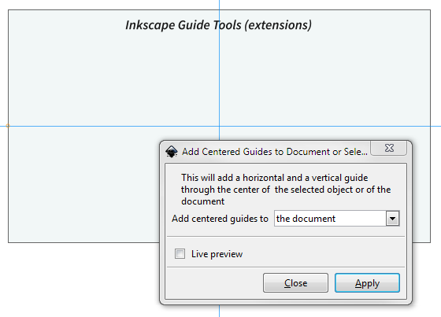
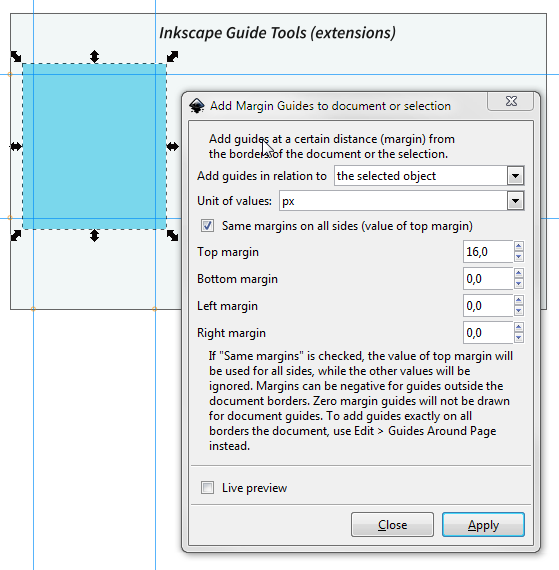
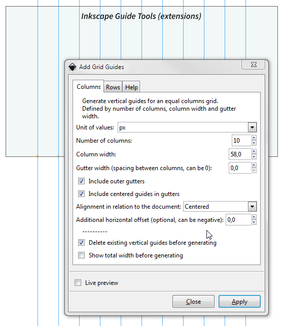
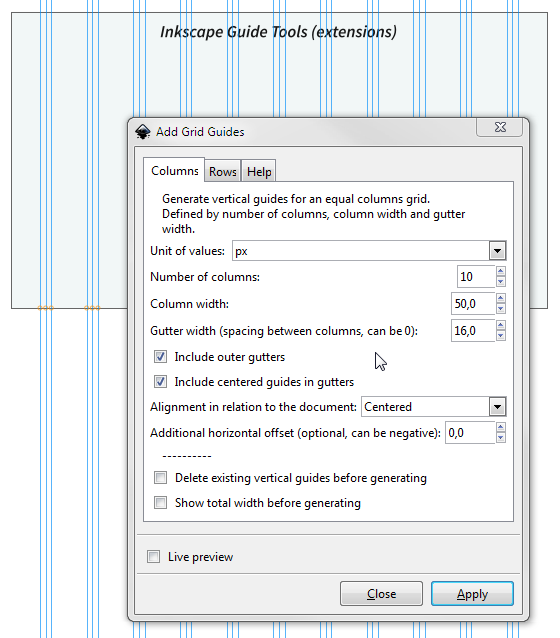
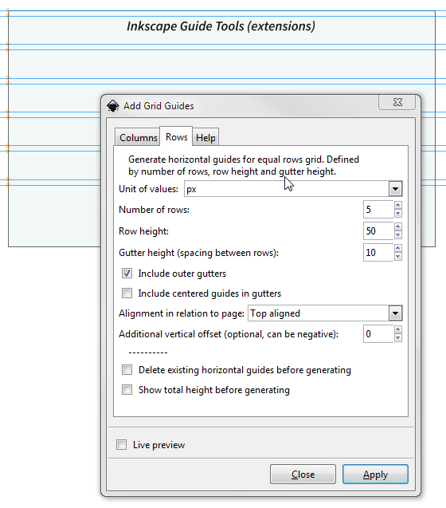
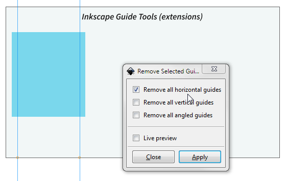
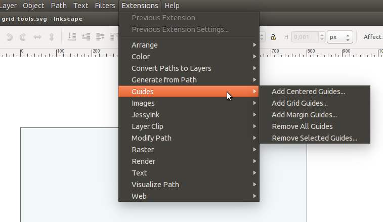

Inkscape guide tools
===================

These are a series of [Inkscape](http://inkscape.org/) extensions related to guides: Add centered guides to page or selection, Add margin guides to page or selection, Add grid guides and Remove selected guides

-----

### 1. Add centered guides to page or object

For quickly adding a horizontal AND vertical guide through the center of the page or a selected object.

Centered guides on a selected object:

Centered guides on the page:

### 2. Add margin guides to page or object

With this extension you can add guides at a certain distance (_margin_) from the borders of the page or a (single) selected object. 

Margin guides to the page:

Margin guides to the bounding box of a selected object:

- Add them all at once for equal margins, or add different margins. 
- Negative margins creates guides _outside_ the page/object borders ("bleed"). 
- Zero margin guides (guides exactly on the border) of the page are not drawn - use **Edit > Guides around page** for that. 
- Use any unit (pixels, mm, in, etc), independant of your page's units.

### 3. Add grid guides

This extension will generate guides in a grid of **equal width columns (or rows) with or without gutters** (spacing between columns). With optional centered guides inside gutters. Use any unit (pixels, mm, etc).

The grid dimensions are defined by the number of columns, the column width and gutter width. Examples:

Columns (vertical guides) without gutters (gutter width set to 0), centered on the page:

Columns with gutters, no outer gutters:

Columns with additional guides through the middle of the gutters, with outer gutters:

Guides in rows with gutters, top aligned:

_Limitation:_ The grid is calculated "inside out" - from the _column width_, gutter width and number of columns, the guides are drawn. It currently cannot draw the guides "outside in" - from a _predefined total width_, a gutter width and number of columns, calculate the columns width and draw the guides. For that, try the Grid Creator extension (menu Extension > Render > Grid Creator). That extension will not draw gutters though...

### 4. Remove selected guides

Selectively remove all horizontal and/or vertical and/or angled (diagonal) guides. 

Tip: To remove ALL guides from your page, instead of using this extension, just go to *Edit > Delete all guides* (Inkscape 0.91 and up)

-----

### Download and install

[Download the latest version](https://github.com/sambody/inkscape-guide-tools/archive/master.zip), which is compatible with Inkscape 0.91 and NOT compatible with Inkscape 0.48 or earlier.

For a version compatible with Inkscape 0.48 or ealier, [download the old version](https://github.com/sambody/inkscape-guide-tools/archive/1.0.zip), which has less features and will no longer be updated.

To install:

1. Unzip (extract) the downloaded archive on your computer;
2. Inside the archive, open the folder named "extensions". Copy all the files that are inside the "extensions" folder (NOT the folder itself) into your user extensions folder, which you can find here:

- on Windows: `C:\Users\YourUserName\.Appdata\Roaming\inkscape\extensions`
- on Linux and OS X: `$HOME/.config/inkscape/extensions/` (where $HOME is your user folder, and .config is a hidden folder)

Restart Inkscape.

### Where to find the extensions menu

The extensions will all be available in the menu under **Extensions > Guide**.

-----

### Tips

- Need a **baseline grid** in addition to the generated columns ? Use Inkscape's grids under File > Document Properties > Grids. Set a new rectangular grid with for example Spacing X = 2000, Spacing Y = 14.
- Using an extension often? In Inkscape 0.91, you can now easily add a **keyboard shortcut** to an extension. See Edit > Preferences > Interface > Keyboard shortcuts.

### What's next

I'm thinking of adding the following features in the future:

- For Inkscape 0.91: add color and label to guides when generating. [Edit: Not possible yet with 0.91, due to a bug]
- It would be nice to also make an "outside in" grid building extension - where you would set a _total width_, a gutter width, and number of columns, and the extension would calculate the columns width and draw the guides. The total width could be defined by a number, or by the page (like the Guide Creator extension, with or without margins), or by the bounding box of a selection...
- ~~Adding centered guides in gutters.~~ Done
- ~~It would be nice if the Margin guides, Centered guides and Grid guides would work _on selected objects_ instead of only on the page.~~ Done
- ~~Remove the "Remove all guides" extension.~~ Done. It's part of Inkscape 0.91 core.
- ~~For Inkscape 0.91: check how units work, adapt extensions accordingly.~~ Done. The extensions are now compatible with Inkscape 0.91.
- ~~The Add Grid Guides and Add Margin Guides should be able to work with other units than pixels. And should not always have to be on round pixel positions.~~  Done - you can now use units different from pixels.
- ~~When generating a grid, it would be cool if one would receive the total width, somehow. Maybe by generating a text element above the grid, with the total width, or with a dialogue box. For example "Columns total width: 980 px"~~ Done - the grid extension now has the option to give you the total width (or height). It's not very elegant, but it works.

### Licence and credits

The Add Grid Guides is heavily based on the code from Grid Creator, part of Inkscape core, under Extensions > Render. Many thanks to that extension's maintainer.

The Remove Selected Guides extensions is based on heathenx's extension _Remove all guides_.

My guide extensions are licenced under the GPL v2, just like Inkscape.

Author: Samuel Dellicour, [web designer](http://www.samplify.be/)