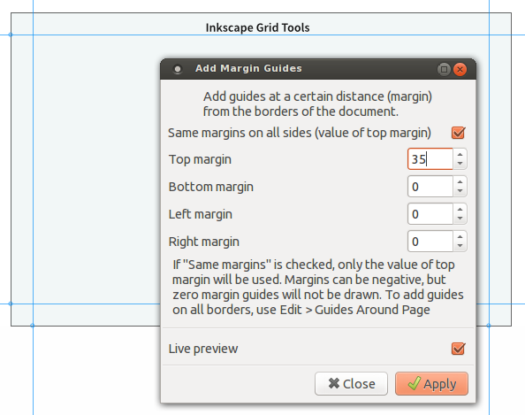
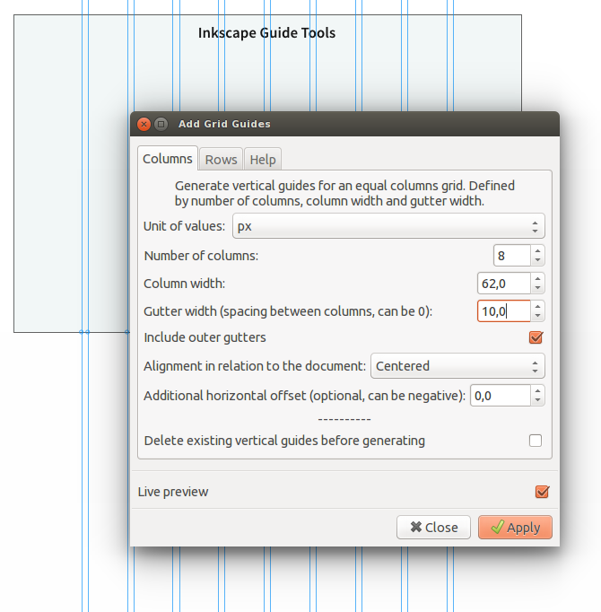
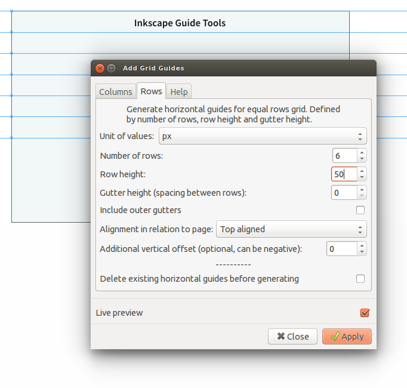
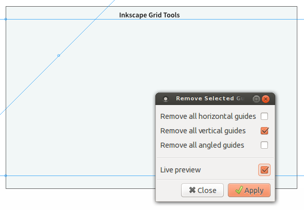

Inkscape guide tools
===================

These are a series of [Inkscape](http://inkscape.org/) extensions related to guides.

### The current extensions are:

1. Add centered guides
2. Add margin guides
3. Add grid guides (formerly Grid Maker)
4. Remove all guides
5. Remove selected guides

### 1. Add centered guides to the document

With this extension you can quickly add a horizontal and/or vertical guide through the center of the document.

### 2. Add margin guides to document

Inkscape already allows you to add guides _exactly_ on the borders of the page, with **Edit > Guides around page**. With this extension you can add guides at a certain distance (_margin_) from the borders of the document. 

- Add them all at once (for equal margins) or separately. 
- Negative margins creates guides _outside_ the page borders. 
- Zero margin guides are not drawn - use the mentioned Guides around Page for that. 
- Use any unit (pixels, mm, in, etc). Independant of your document's units.

### 3. Add grid guides

This extension will generate guides in a grid of **equal width columns (or rows) with gutters** (spacing between columns). Use any unit (pixels, mm, etc).

**Example 1**: Columns (vertical guides), with gutters, centered on the document

**Example 2**: Rows (horizontal guides), gutters set to 0, top aligned

This extension was conceived as a tool for grids in designing websites in Inkscape, using pixels. But it now works with other units too (mm, in, etc)

_With the Add Grid Guides extension, you can..._

- create **columns** with gutters (vertical guides), and **rows** with gutters (horizontal guides);
- **define the number of columns, the column width and gutter width** to generate a grid; same with rows;
- generate **evenly spaced guides** *without* gutters by setting gutter width to 0;
- choose to align the grid in relation to the page: left aligned, centered or right aligned;
- optionnally add an extra horizontal/vertical offset, for example to generate the grid at a certain distance from the page border (when left/right aligned); this offset can be negative; for columns, this offset is a shift to the right (when positive), for rows it is a shift down (when positive);
- optionnally delete all existing horizontal/vertical guides before generating the new guides;
- see a preview using Live preview, to test different widths.
- let it give you the total width (or height for rows) - useful when generating a grid that needs to be contained within a certain width (or height).

_Tips:_

- Need **guides in the middle of your gutters**? After generating the columns, generate a new grid with gutters set to zero, with column width set to [original column width + gutter width] - this will generate the centered guides in your gutters. If you need centered guides positioned on round pixels, be sure to use an even number for the original gutter width.
- You can generate **grids side by side** by using a very large offset, one after the other.
- Need a **baseline grid** in addition to the generated columns ? Use Inkscape's grids under File > Document Properties > Grids. Set a new rectangular grid with for example Spacing X = 2000, Spacing Y = 14.

_Limitations:_

- The grid is calculated "inside out" - from the _column width_, gutter width and number of columns, the guides are drawn. It currently cannot draw the guides "outside in" - from a _predefined total width_, a gutter width and number of columns, calculate the columns width and draw the guides. For that, try the Grid Creator extension (menu Extension > Render > Grid Creator). That extension will not draw gutters though...

The Add Grid Guides is heavily based on the code from Grid Creator, part of Inkscape core, under Extensions > Render. Many thanks to that extension's maintainer.

### 4. Remove all guides

This extension is actually made by heathenx, bundled here with his permission. See [this blog post](http://screencasters.heathenx.org/blog/2009/06/09/inkscape-extension-remove-guides/) and [this forum topic](https://www.ruby-forum.com/topic/188929). I've just moved the extension's menu item to Extensions > Guides; this functionality may become part of inkscape in upcoming version 0.49

(no user interface, so no screenshot) 

### 5. Remove selected guides

Selectively remove all horizontal and/or vertical and/or angled (diagonal) guides. Based on heathenx's extension _Remove all guides_.

### How to install the extensions

1. [Download the zip archive](https://github.com/sambody/inkscape-guide-tools/archive/master.zip) to your computer;
2. Unzip (extract) the archive on your computer;
3. Open it. In the folder "extensions", you will find the extension files - they come in pairs, an .inx and .py file for each extension. Copy these files (not the folder) into your Inkscape extensions folder, which you can find here:

- on Windows: "C:\Program Files\Inkscape\share\extensions"
- on Linux: " /home/yourusername/.config/inkscape/extensions" (.config is a hidden folder)
- on OS X: "/Applications/Inkscape.app/Contents/Resources/extensions" 

Restart or open Inkscape.

### Where to find the extension menu items

The extensions will all be available in the menu under **Extensions > Guide**.

### Adding a keyboard shortcut

Using an extension often? You can add a keyboard shortcut to any inkscape extension, manually, by editing an xml file with user keyboard shortcuts.

Edit your [user shortcuts files](http://wiki.inkscape.org/wiki/index.php/Customizing_Inkscape) (on Linux, it's /home/yourusername/.config/inkscape/keys/default.xml, on Windows, it's in Program Files\Inkscape\share\keys\default.xml.) 

For example, this will add the shortcut Ctrl-Shift-Alt-G to add centered guides:

`<bind key="G" modifiers="Ctrl,Alt,Shift" action="samplify.add_centered_guides" display="true"/>`

`<bind action="samplify.add_margin_guides" display="true"/>`

`<bind action="samplify.add_grid_guides" display="true"/>`

`<bind action="samplify.remove_guides" display="true"/>`

`<bind action="samplify.remove_selected_guides" display="true"/>`

Note: you may want to check first to see if the new keyboard shortcuts already exist in your file or in the default shortcuts file.

### What's next

- It would be nice to also make an "outside in" grid building extension - where you would set a _total width_, a gutter width, and number of columns, and the extension would calculate the columns width and draw the guides. The total width could be defined by a number, or by the document (with or without margins), or by the bounding box of a selection...
- It would be nice if the Margin guides, Centered guides and Grid guides would work _on selected objects_ instead of only on the document.
- ~~The Add Grid Guides and Add Margin Guides should be able to work with other units than pixels. And should not always have to be on round pixel positions.~~  Done - you can now use units different from pixels.
- ~~When generating a grid, it would be cool if one would receive the total width, somehow. Maybe by generating a text element above the grid, with the total width, or with a dialogue box. For example "Columns total width: 980 px"~~ Done - the grid extension now has the option to give you the total width (or height). It's not very elegant, but it works.
- Generating a diagonal grid? Or just rotating existing guides?

### Licence

These guide extensions are licenced under the GPL v2, just like Inkscape.

Author: Samuel Dellicour